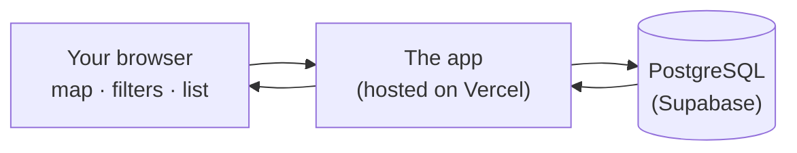
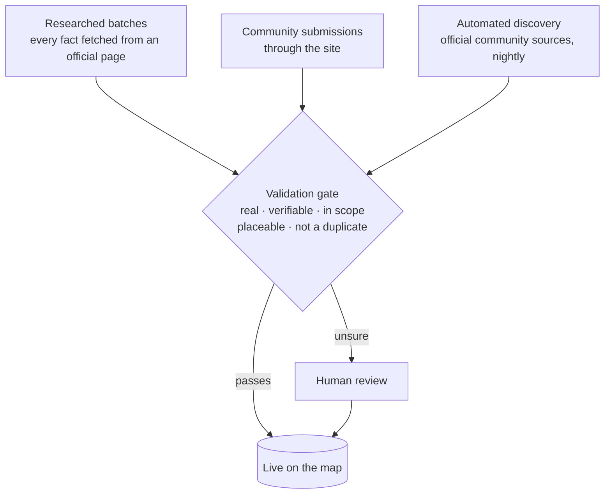

# How it works

A plain-language tour of what's behind the map. The code is private; this page explains the
design.

## The big picture

Acoustics Explorer is a single web application. There is no separate backend server: the
same app renders the page, reads the database and hands the data to the map in your browser.

Every page load reads the current data, so what you see is always what's in the database
right now. Entries whose dates have passed fade out on their own after a grace period;
nothing is silently deleted.

## Where the entries come from

Entries arrive three ways, and all three pass the same gate.

- **Researched batches** are gathered by hand, region by region, and every fact is checked
  against the organiser's own page.
- **Submissions** from the community stay invisible until a moderator approves them.
- **Automated discovery** reads official community listings every night. Only entries backed
  by structured data (the machine-readable event and job descriptions many sites publish)
  are trusted automatically; anything read from free text goes to a person first.

The rules are enforced in code, not just policy: every entry must be placeable on the map,
its official link must be unique, and a nightly check re-tests every link so dead postings
are flagged for review.

## What you can trust on a card

Each entry shows its provenance: **✓ Human-reviewed**, or *machine-checked, not yet
human-reviewed*. Status (soon, open, closed) is worked out from the dates when you load the
page, so it's never stale.

## Privacy by design

- **No accounts needed to browse or keep a list.** My list, your filters and your theme are
  stored in your own browser and never leave it.
- **No analytics, ads or trackers.**
- **Sign-in is only for submitting**, by email link or password, and uses a single
  strictly-necessary cookie.
- The database is locked down: the sign-in service can't read or write data, and every
  data change goes through the app's own checks.
- Written for Brazil's LGPD first, and the EU's GDPR.

## Accessibility approach

Accessibility is checked, not assumed: contrast is measured on rendered pixels in every
skin, the app is tested with a real screen reader on a phone, and every control can be
reached from the keyboard. See the [README](README.md#accessible-by-design) for the details
and the [roadmap](ROADMAP.md) for the known gaps.

## Hosting

| Piece | Service |
| --- | --- |
| The app | Vercel |
| The database | PostgreSQL on Supabase (Frankfurt) |
| Maps | MapLibre GL with CARTO basemaps and Natural Earth country shapes |

Each piece can be swapped without rewriting the others.
