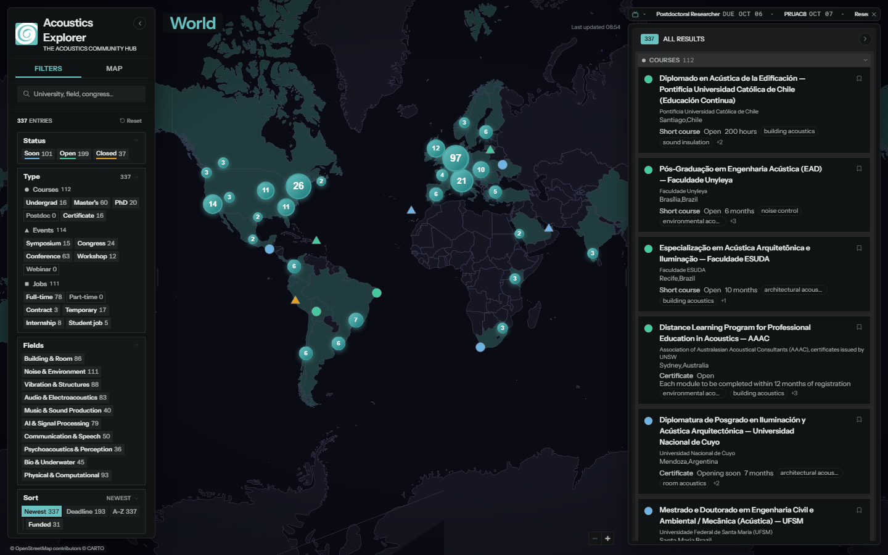
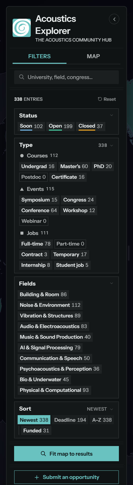
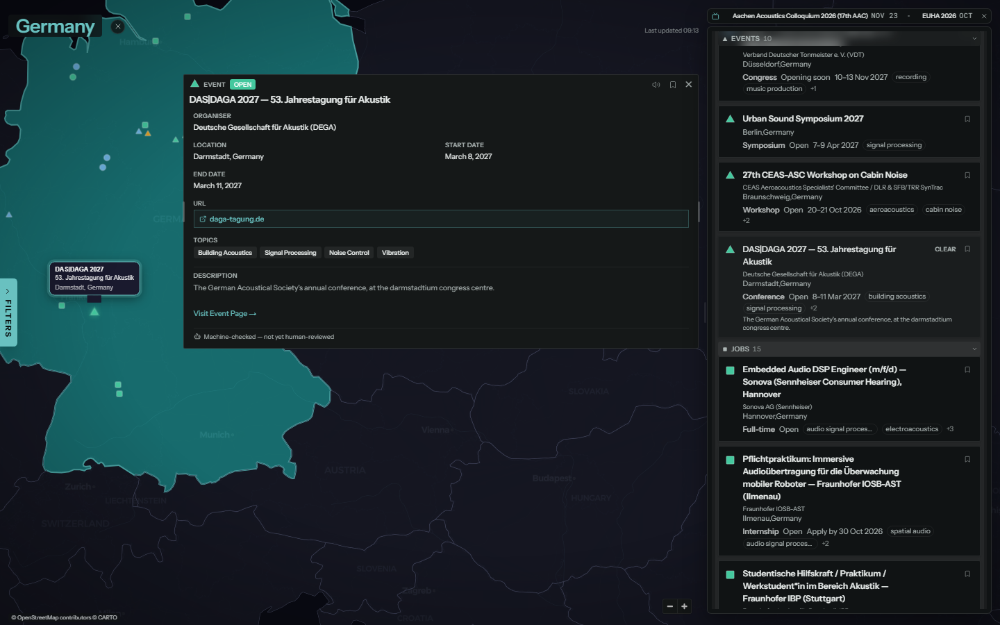
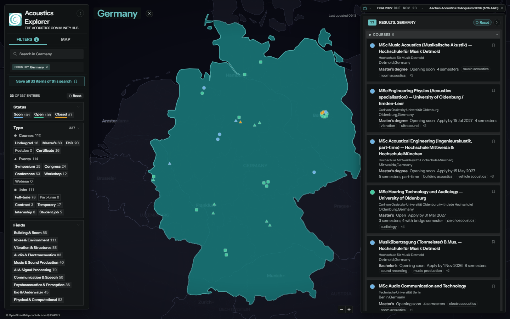
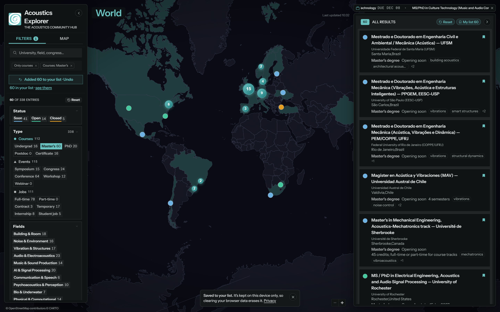
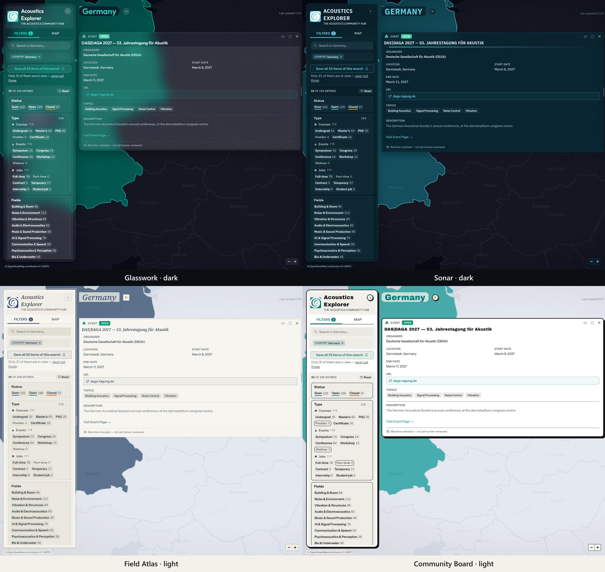

# Acoustics Explorer

### The Acoustics Community Hub

Courses, events and jobs in **acoustic engineering**, scattered across hundreds of
universities, societies and companies, gathered onto one interactive world map.

**330+ opportunities · 55+ countries · 230+ cities · every entry traced to an official source**

**[→ Open the live map at acousticsexplorer.org](https://www.acousticsexplorer.org)**

---

## Why it exists

If you work or study in acoustics, the next master's programme, congress or job is out
there, but it's spread across society calendars, university pages and company career
sites in a dozen languages. Acoustics Explorer puts it all on one map, checks every entry
against its official source, and keeps it current.

It's built by an acoustic engineer, for acousticians: students looking for a programme,
researchers looking for the next symposium, and engineers looking for their next role.

## What you can do

### See everything on one map

Markers are **shaped** by category (● course, ▲ event, ■ job) and **coloured** by status:
blue *soon*, green *open*, orange *closed*. Nearby entries cluster, and zooming splits them
apart.

### Narrow it down in one tap

The sidebar reads top to bottom, and every chip carries a **live count** of what it would
show. Nothing selected means everything; tapping a chip means *show only this*.

**Search.** Type a university, a city, a congress or a topic. Matches turn into removable
chips, and tapping a topic on any card adds it as a filter too.

**Status.** *Soon*, *open* or *closed*, worked out from the dates every time you load the
page, so it's never stale. Each status has its own colour on the map, and it's always
written as a word too.

**Type.** Three families, each split the way people actually search:

- **Courses**: undergraduate, master's, PhD, postdoc and certificates
- **Events**: symposia, congresses, conferences, workshops and webinars
- **Jobs**: full-time, part-time, contract, temporary, internships and student jobs

**Fields.** Ten areas of acoustics: building & room, noise & environment, vibration &
structures, audio & electroacoustics, music & sound production, AI & signal processing,
communication & speech, psychoacoustics & perception, bio & underwater, and physical &
computational. Pick one or several.

**Sort.** Newest first, closest deadline, or A–Z, and **Funded** keeps only the
opportunities with funding we've found.

**Fit map to results** frames whatever is left, and **Save all** puts the whole search into
your list in one tap (more on that [below](#keep-your-own-list-no-account-needed)).

**Reset** brings everything back in one tap: chips, search terms and the selected country
together. Your choices are remembered on this device, so the map opens the way you left it.

**The Map tab** holds the legend, and the legend is a filter too: hide a category or a
status straight from it, or turn the markers off to see the countries underneath. It's also
where you switch between light and dark and pick one of the seven skins.

**Submit an opportunity** sits at the bottom, one tap away from wherever you are, and it
needs no account either.

 

### Open an entry and the map follows

The map flies to the city and opens a card with what matters: organiser, location, dates,
deadline, topics, and a link to the official page. Every card says whether a person has
reviewed it (**✓ Human-reviewed**) or it was machine-checked only.

### Explore a country

Pick a country and everything scopes to it: the camera frames it, the results filter to it,
and the address becomes a link you can share.

### Keep your own list, no account needed

There's nothing to sign up for. Tap the **bookmark** on any card or result row and the entry
goes into **My list**.

- **Save a whole search at once.** Narrow the map with a few filters or a country, then tap
  **Save all** to add every match. If you change your mind, **Undo** removes just those.
- **Just the ones in view.** If only some matches are on screen, you can save only those.
- **See only your list.** The **My list** button in the results filters the map, the markers
  and the results down to what you saved. Tap it again to see everything.
- **Start over** with *Clear all* (it asks twice, so one stray tap won't wipe it).

The list lives **in your browser only**: no account, no server, nothing sent anywhere. The
first time you save something, a short note says so. The flip side is that clearing your
browser data erases the list, and it doesn't follow you to another device (yet, see the
[roadmap](ROADMAP.md)).

### Suggest an opportunity

Anyone can submit a course, event or job, again with no account. Paste a link and the form
fills itself in; every submission is reviewed before it appears.

## Seven looks, light and dark

**Anechoic** (the default: precision lab), **Glasswork**, **Sonar**, **Control Room**,
**Field Atlas**, **Community Board** and **High Contrast**, each in light and dark. They
change typography, panels and the map's palette, never the layout.

## Accessible by design

- Colour-blind-safe status colours ([Okabe–Ito](https://jfly.uni-koeln.de/color/)), and
  status is always written out as a word too.
- A **High Contrast** skin with 19:1+ text and [Atkinson Hyperlegible](https://brailleinstitute.org/freefont).
- Full keyboard and screen-reader support, tested with **VoiceOver** on iPhone.
- **Read aloud** on every entry, in your browser's own voice.
- 44px touch targets on phones, and reduced motion respected everywhere.

The known gaps are listed openly in the [roadmap](ROADMAP.md).

## Trustworthy by rule

An entry is published only when it is a **specific, named opportunity**, confirmed by an
**official page that actually loads**, from a **legitimate organiser**, **in scope** for
acoustics, **placeable** on the map and **not a duplicate**. Anything that would need guessing
is left out: an honest gap beats invented data. [How it works](HOW-IT-WORKS.md) explains the
pipeline.

## Privacy

No ads, no analytics, no tracking, and **no cookies**: there are no visitor accounts at all.
Your list, filters and theme stay in your own browser. Fonts and country shapes are served by
the site itself; the only outside request is for the map tiles (CARTO).

## Built with

Next.js · React · TypeScript · Tailwind CSS · MapLibre GL · PostgreSQL (Supabase) · Prisma ·
Vercel. Map data from Natural Earth, CARTO and © OpenStreetMap contributors.

## Get involved

The source code is private, but there's plenty you can do here:

- **Suggest an opportunity or a source** the map is missing
- **Report a bug** or something that looks wrong
- **Share an idea**

Use the [issue templates](../../issues/new/choose), or see [CONTRIBUTING.md](CONTRIBUTING.md).
What's coming next is in the [roadmap](ROADMAP.md), and what changed is in the
[changelog](CHANGELOG.md).

## About

Created by **Bárbara Circe**, acoustic engineer, and developed with Claude (Anthropic).
The first layout started from the M.O.N.K.Y Dashboard community template on v0 by Vercel.

© 2026 Bárbara Circe. All rights reserved. "Acoustics Explorer", "The Acoustics Community
Hub" and the spiral mark are her trademarks. See [LICENSE](LICENSE).
